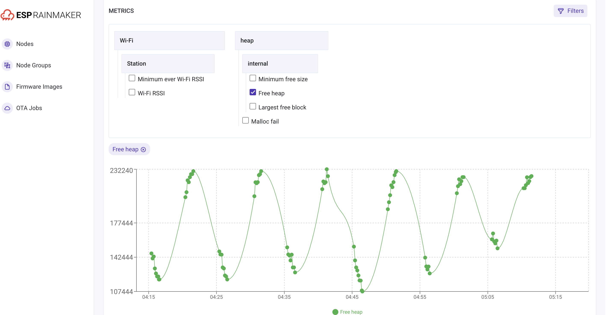

# Smoke Test App

## What to expect in this example?

- This example is expected to exercise the various features of the ESP Insights framework
- As a smoke test, this allows you to validate, by a quick perusal of the ESP Insights dashboard, the functioning of all the high-level features

## End-to-End Tests

### Lifecycle of the test (Hard reset resets the cycle)
* Device boots up and logs errors/warnings/events in random order every 10 seconds
* Every error/warning/event log with "diag_smoke" tag is associated with an incremental counter
* There's a 30/500 probability that device will crash, this is done for verification of crash
* Device will crash only five times and hard reset will reset the counter to 1
* On sixth boot onwards device will not crash and logs errors/warnings/events and adds heap metrics

### Setup
* Build and flash diagnostics_smoke_test application and monitor the console
* Device will eventually crash after some time
* Before every crash you will see below log print
```
E (75826) diag_smoke: [count][7] [crash_count][1] [excvaddr][0x0f] Crashing...
// [count][7]: count associated with the log
// [crash_count][1]: This is the first crash since device boot up, this number will increment as the crash count increases
// [excvaddr][0x0f]: Exception vaddr, will see this in crash verification part below
```
* You'll see five crashes([crash_count][5]) and after that device will not crash and will keep on logging and adding metrics
* Onwards this point keep device running for more than 30 minutes
* Now we are all set to visit the [dashboard](https://dashboard.rainmaker.espressif.com)
* Select the node-id printed on the console, look for the below log. It is printed early when device boots up
```
I (1717) esp_insights: ESP Insights enabled for Node ID ----- wx3vEoGgJPk7Rn5JvRUFs9
```

### Unknown package/firmware image missing
* Visit the _Node Reports_ page and change to day view, make sure you are viewing logs for the present day
* Verify that the logs indicate that the Firmware Image is missing to perform the cross-referencing
* Verify that the older logs, if any, continue to be viewed properly

### Valid Package/Firmware Image
* Upload the Firmware Image through the Firmware Image section

### Timestamps
* Verify logs are added for the appropriate day in the device-timeline
* Note the count of crash/error/warnings for today - Variable-Timestamps-1
* Click on the day to zoom-in
* Add up the hourly crashes/errors/warnings/events for the day, and verify that it matches Variable-Timestamps-1
* Verify that the errors/warnings in the device-timeline match your local time when you started the test
* Verify that the timestamps of the specific errors/warnings in the detailed log below match the local time of your device when you started the test

### Errors/Warnings/Events
* Verify that, in the device logs, there are no 'gaps' in the incremental numbers that are printed for every line
* Verify that, in the device logs, an error with count x, matches the error in the console log
* Verify that, in the device logs, a warning with count x, matches the warning in the console log
* Verify that, in the device logs, a event(info log) with count x, matches the info log in the console log
* NOTE: If device buffer is full and device is not connected to internet, it drops the logs

### Metrics
* Once device has published enough metrics data to visualize, head over to Metrics page
* Verify that filters have heap and Wi-Fi metrics
* Open filters and select _Free heap_ option, you should be able to see the sinusoidal wave in there, please see the below screenshot for reference

* Graph for _Minimum free size_ should always be declining
* Graph for _RSSI_ depends on the Wi-Fi strength, if possible move around the AP or ESP device to see some data points there

### Variables
* Open the Variables page and verify that it has IP and Wi-Fi variables present
* Verify the last updated timestamp is latest

### Cross-referencing
* Verify that file as well as line number, in the detailed logs, match those in your test program
* If required, next time you do the test purposefully, add a couple of extra new lines to your program
* Verify that in the crash report, the backtrace references the correct file and line number from your program
* Verify that the crash type is identified correctly
* Verify that the reboot-type is identified correctly for every reboot

### Crash
* Verify the values of registers listed on dashboard match with the registers on the console
* Verify that the error/warning line _Crashing..._ is seen before the crash report (validates preserving logs across reboots. Sometimes device storage may get full and device starts dropping the logs)
* Please verify the `excvaddr` address is same as the one printed in _Crashing..._ log line, [excvaddr][0x0f]

### Pagination
* Note the timestamp of the top-line of your details logs - Variable-Pagination-1
* Verify that pressing the Back button at the bottom takes you to the logs from the previous day
* Verify that the timestamp on the last line of this page is less than Variable-Pagination-1

### Access Control
* Go to a device log
* In the browser edit the URL so that you replace the node-id with another valid node-id that is not OWNed by you. Verify that you can NOT access that device's details in the device log
